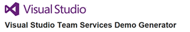

## Deploy Asp.Net application to Azure App Service using VSTS

This lab will show you how you can deploy an ASP.Net application to Azure App Service using an CI/CD pipeline in Visual Studio Team Services.

## Pre-requisites
<table>
   <tr>
      <td valign="top">
         
      </td>
      <td><b>Microsoft Azure Account:</b> You will need a valid and active azure account for the labs.</td>
   </tr>
   <tr>
      <td valign="top">
          
         
      </td>
      <td> You need a <b>VSTS account name</b> and <b>PAT</b>. Refer <a href="http://bit.ly/2gBL4r4">here</a> for more information on PAT. </td>
   </tr>
</table>

Use <a href="https://vstsdemogenerator.azurewebsites.net">VSTSDemoDataGenerator</a> to provision <b>PartsUnlimited</b> project.

Since we need build artifacts to be deployed to Azure App Service, we need to generate one by changing the code and following through CI build. Below are the steps to follow the same.
## Configuring the CI/CD pipeline

1. Navigate to the project that was created and go to **Code** hub.

   

2. Open the file **Index.cshtml** by navigating to the path **PartsUnlimited-aspnet45/src/PartsUnlimitedWebsite/Views/Home/Index.cshtml**

   

3. Click on edit and change the **line number 28** to **70%**.

   

4. **Commit** after doing the changes. 

5. Go to the **Build** tab to see the CI build running in progress.

   

   

6. Once the build is completed, you can see the summary which shows **test results, code coverage** etc as shown below.

   

7. Now let's go and see if the release has started to deploy on to Azure App Service.

## Continuous Deployment

We are using Infrastructure as a Code in our release pipeline which provides the required infra on Azure Environment during the deployment phase. You can notice it by logging into [Azure Portal](https://portal.azure.com)

Once the release is successful, you can login to azure and check a **Resource Group** with the name **AspDotNet** would have got created. It's associated with few other resources like **SQL server, SQL DB, WebApps** etc as shown below.

Navigate to one of the WebApp from the resource group and you should see the application is deployed successfully with the changes made earlier as shown.

