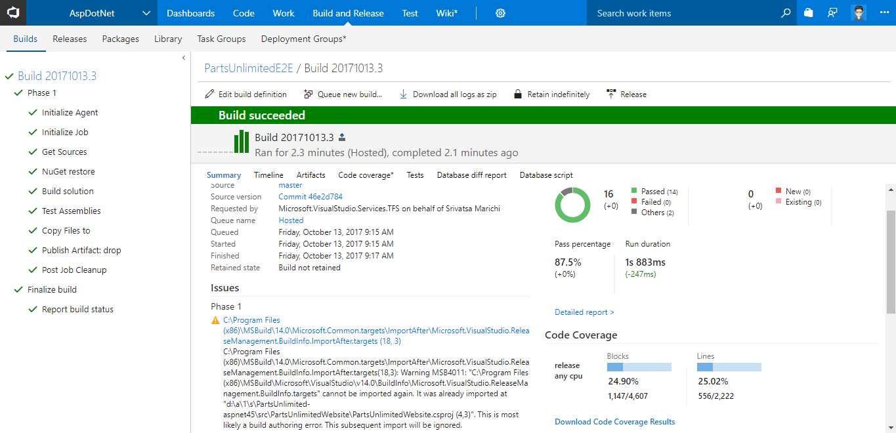
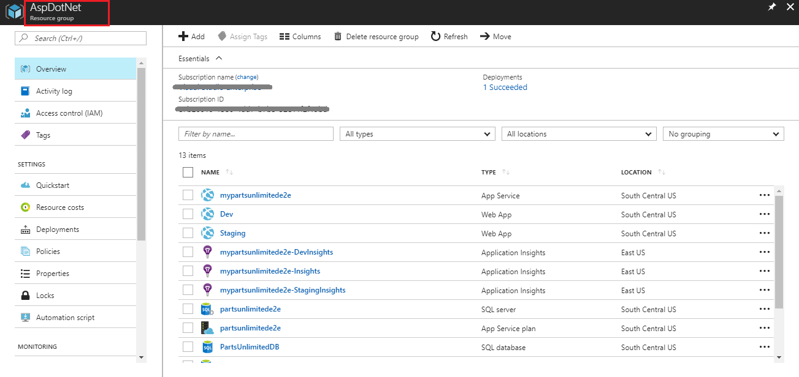

## Deploy ASP.Net application to Azure App Service using Team Services

This lab shows how you can deploy an **ASP.Net application to Azure App Service using an CI/CD pipeline in Visual Studio Team Services**.

## Pre-requisites
1. Microsoft Azure Account:</b> You will need a valid and active azure account for the labs.

1.  You need a <b>Visual Studio Team Services Account</b> and <a href="http://bit.ly/2gBL4r4">Personal Access Token</a>

## Setting up the project
1. Use <a href="https://vstsdemogenerator.azurewebsites.net" target="_blank">VSTS Demo Data Generator</a> to provision a project on your VSTS account 

 

 2. Select **PartsUnlimited** for the template

 

3. Once the project is provisioned, select the URL to navigate to the project that you provisioned

## Configuring the CI/CD pipeline

1. Let's start from code . Navigate to the **Code** hub 

   

1. We have an ASP.NET app code provisioned by the demo generator system. We will deploy this to Azure app service

1. We have a Continious Integration (CI) build setup to run upon a code commit. Let's make a simple change to the code to trigger the CI build

2. Open the file **Index.cshtml** by navigating to the path **PartsUnlimited-aspnet45/src/PartsUnlimitedWebsite/Views/Home/Index.cshtml**

   

3. Edit the code. For this example, let's change line 28 to increase discount from **50%** to **70%** 

   

4. Select **Commit** to save and commit the changes. 

5. The code commit will trigger the CI build. Go to the **Build** tab to see the CI build running in progress.

   

   

6. Once the build is completed, you can see the summary which shows **test results, code coverage** etc as shown below.

   

## Continuous Delivery

we have a relase pipeline configured to deploy the application. It is associate to the build and triggered when the build is successful. Let's look at the release pipeline.

1. Navigate to the **Releases** tab under **Build and Release** hub

2. Select the **PartsUnlimitedE2E** definition and choose **Edit**

3. We have two environments **QA** and **Production**

We are using **Infrastructure as a Code** in the release pipeline with an ARM template to provision the required infrastructure (Web App and SQL database) on Azure 

Once the release is successful, you can login to [Azure Portal](https://portal.azure.com) and search a **Resource Group** with the name **AspDotNet** that would have got created. It would be associated with few other resources like **SQL server, SQL DB, WebApps** etc as shown below.

Navigate to one of the WebApp from the resource group and you should see the application is deployed successfully with the changes made earlier as shown.

