# Deploying a Dockerized Java App to Azure with Team Services

## Overview 

Containers have fundamentally changed the way developers develop their applications, the way applications are deployed, and the way system administrators manage their environments. Containers offer a broadly accepted and open standard, enabling simple portability between platforms and between clouds. 

With **Azure Web App** for containers, it is easy to deploy container-based web apps. You can pull container images from Docker Hub or a private Azure Container Registry, and deploy the containerized app with your preferred dependencies to production in seconds.

### What's covered in this lab

In this lab, you will learn how you can setup a Continuous Delivery pipeline to build, deploy and run a Dockerized Java application with Visual Studio Team Services and Azure

This lab will show how you can

* Create a new Azure Container Registry to store and manage your Docker container images
* Create an Azure web app to host a container
* Create a new MySQL database
* Use Azure App Service Task to deploy image to container

### Prerequisites for the lab

* **Visual Studio Team Services**: You will need a Visual Studio Team Services Account. If you do not have one, you can sign up for free [here](https://www.visualstudio.com/products/visual-studio-team-services-vs)

* **Microsoft Azure Account**: You will need a valid and active Azure account for the Azure labs. 

> Please see the **Content Window** for the username/password that you can use for the lab

## Exercise 1: Setting up the Environment - Azure 

You will start this lab by first creating **Azure Container Registry** -  a managed Docker registry service based on the open-source Docker Registry 2.0.to store and manage your private Docker container images

1. Open the [**Azure Portal**](https://portal.azure.com) in a separate tab

1. Select **+Create a resource** and search for **Azure Container Registry**. Select **Create**. In the *Create Container Registry* dialog, enter a name for the service, select the resource group, location, **Enable** Admin User etc., and select **Create**.

    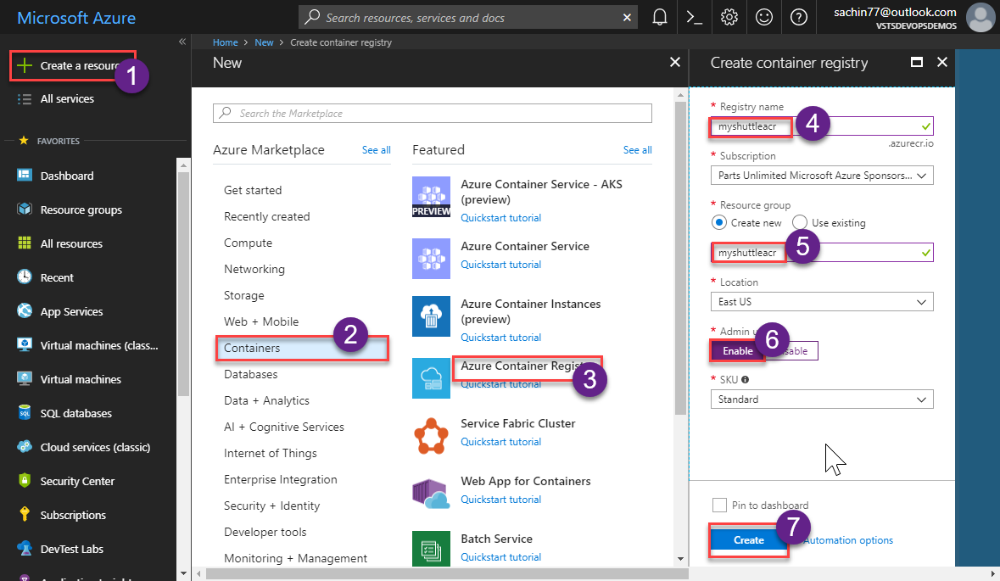

It should take a couple of minutes for the container registry to be provisioned

## Exercise 2: Setting up the Environment - Team Services

Next, you will create a Team services project to establish a repository for source code and a place for your team to plan, track progress, and collaborate on building software solutions

1. Navigate to your Team Services account home page - `{https://youraccountname.visualstuduio.com}`

1. Select **New Project** to create a new project. Provide a project name and select **Create**

    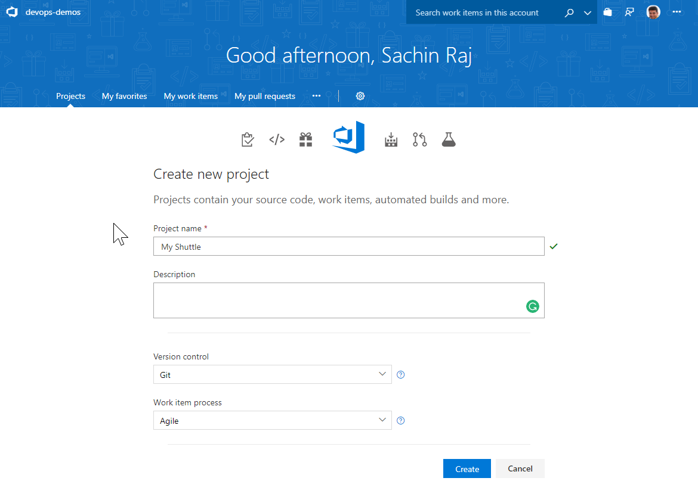

1. This should create an empty project. Next, you will add code to the project. Team Services supports **Git**. Navigate to the **Code** tab, click on **Copy push commands to clipboard** and save the commands to notepad. We will need this commands later in this exercise.
     
      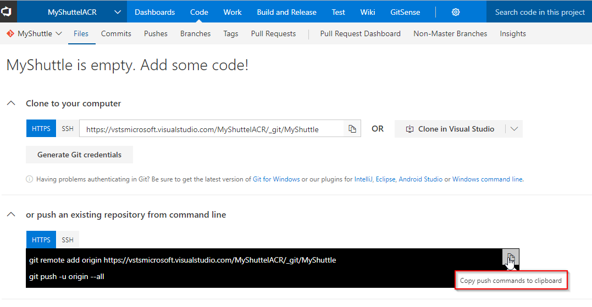

1. Open a **Terminal** window and enter the following command to change the current working directory

    ````bash
    cd \home\eclipsevm\myshuttledocker
    ````

1. Next initialize a git repo in the current folder
    ````bash
    git init
    ````
1. Add the files and stage them for commit
    ````bash
    git add .
    ````
1. Git uses a username to associate commits with an identity. Run the following commands to associate your identity with your Git commits.
 
   ````bash
    git config --global user.email "YourEmailID"
    git config --global user.name "YourName"
    ````
    > Replace  **YourEmailID** & **YourName** with your VSTS email id and your name
1. Commit the files that you've staged in your local repository.

    ````
    git commit -m "Initial Commit"
    ````
1. Next paste the text you copied to add the local repo to the remote Git repo and push the changes. You may be prompted to enter your credentials in order to push the changes.

    ````
    git remote add origin https://devops-demos.visualstudio.com/DefaultCollection/_git/My%20Shuttle
    git push -u origin --all
    ````

1. Once the code is pushed, you can verify it by going to the Team Services portal and refreshing the code hub page. 
    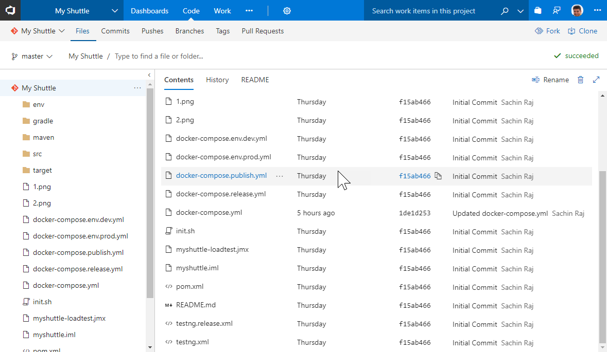

### Agile planning

Next, you will see how you can use Team Services to plan, manage, and track work across entire team. Team Services provides a suite of Agile tools that support the core Agile methods—Scrum and Kanban—used by software development teams today. 

1. Navigate to the **Work** hub

1. Add a new **User story** to the project. Enter a title and select **Add**

    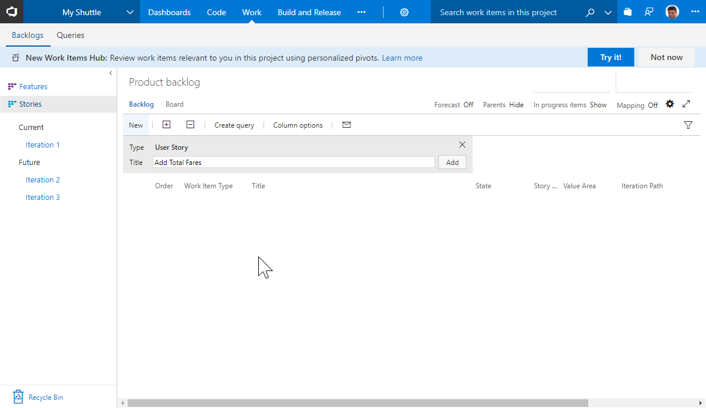

1. Next, you will add tasks. Click the "+" and select **Task**

     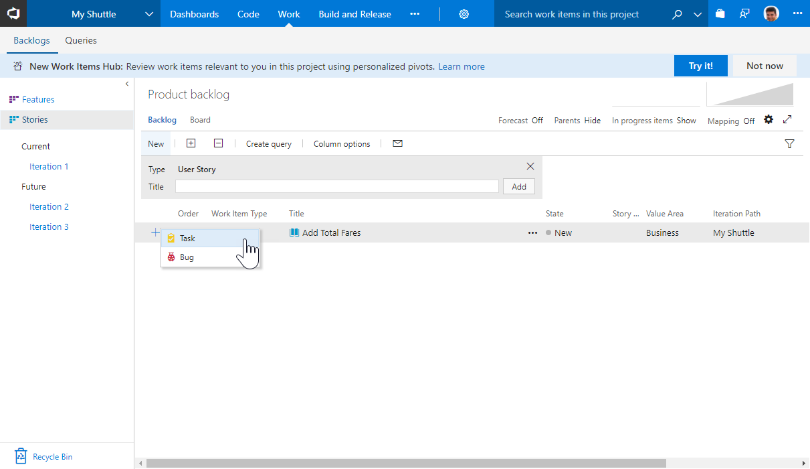

1. Provide a title and assign the task to yourself

    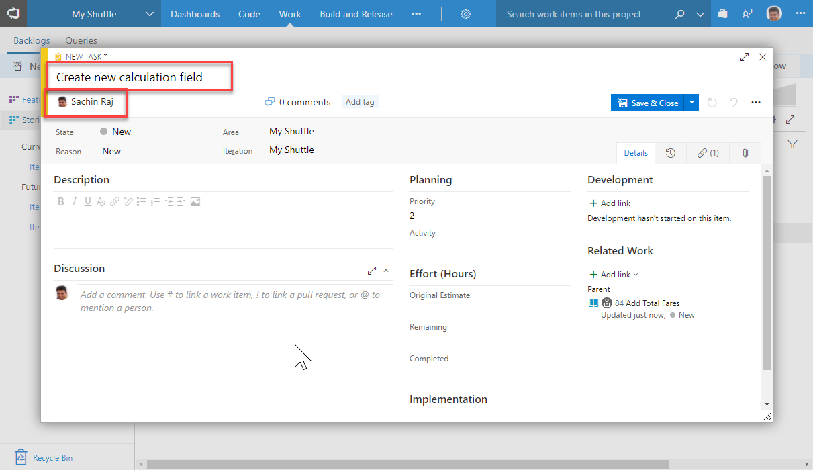

1. Next, select **Board** to switch to *Kanban Board*. The Kanban board turns your backlog into an interactive signboard, providing a visual flow of work.

1. Select the card that represents the user story you created. Drag and drop to move the card to the **Active Column**

    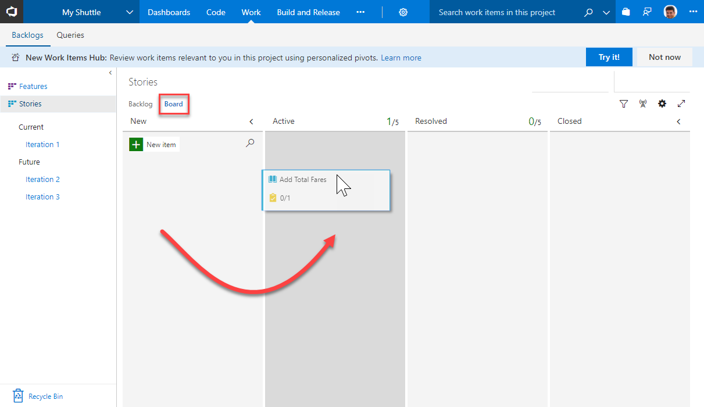

    > It is typically recommended to start work on a work item by creating a branch. Branches allow you to isolate changes and track the associated work items for the changes. You can add a new Git branch by clicking the *Ellipsis* from within the card and selecting **New Branch**. Team Services will create a new branch and automatically associate the work item to the branch

1. You can also manually link the work item to a particular branch, commit, Pull request, etc., by opening the work item and selecting the **+ Add link** button under **Development**

    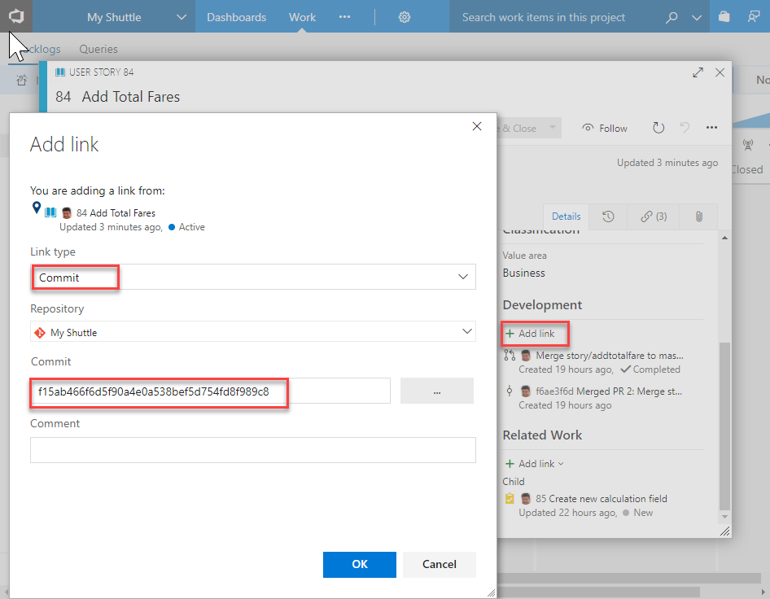

    > You can edit a file within the web portal.Or, if you have extensive file edits or need to add files, then you'll need to work from Eclipse, IntelliJ, Visual Studio or other supported IDE

## Exercise 3:  Create a Team Services Build to Build Docker Images

Next you will build a CI/CD pipeline in Team Services that will build and push the image to an Azure Container Registry

1. Select the **Build** hub. Click the **+ New definition**  button to create a new build definition. 

1. Make sure **VSTS Git** is selected for the source and the project, repository and branch have the correct values.  Select **Continue**.

1. Select **Maven** for the template as we are building a Java application using Maven

1. Select the *maven* task and update the following settings

    | Parameter | Value | Notes |
    | --------------- | ---------------------------- | ----------------------------------------------------------- |
    | Options | `-DskipITs --settings ./maven/settings.xml` | runs specific (unit)tests during the build |
    |Code Coverage Tool | JaCoCo | Selects JaCoCo as the coverage tool |
    | Source Files Directory | `src/main` | Sets the source files directory for JaCoCo |

      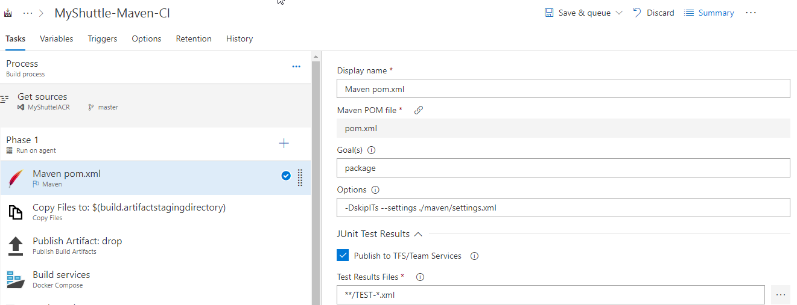

1. Then select the **Copy Files** task. Change the following parameters

    | Parameter | Value | Notes |
    | --------------- | ---------------------------- | ----------------------------------------------------------- |
    | Source Folder | `$(build.sourcesdirectory)` | |
    |Contents | target/myshuttledev\*.war |the WAR file to copy  |
    | Target Folder | `$(build.artifactstagingdirectory)` | Target folder to copy to |


1. You can leave the **Publish** tasks with the default values

1. Next you will add Docker tasks build and publish the images. Select the **+** button next to **Phase 1** and enter **docker** in the search window to filter. Select the **Docker Compose** tasks and click the **Add** button twice to add tasks

1. Now, select the first task you added and Set the **Action** to **Build Service Images**.

    | Parameter | Value | Notes |
    | --------------- | ---------------------------- | ------------------------------------------- |
    | Container Registry Type | Azure Container Registry | This is to connect to the Azure Container Registry you created earlier |
    | Azure Subscription | Your Azure subscription | The subscription that contains your registry. **Note** Click the **Authorize** button if you are prompted to do so |
    | Azure Container Registry | Your registry | Select the Azure Container registry you created earlier |
    | Additional Image Tags | `$(Build.BuildNumber)` | Sets a unique tag for each instance of the build |
    | Include Latest Tag | Check (set to true) | Adds the `latest` tag to the images produced by this build |

   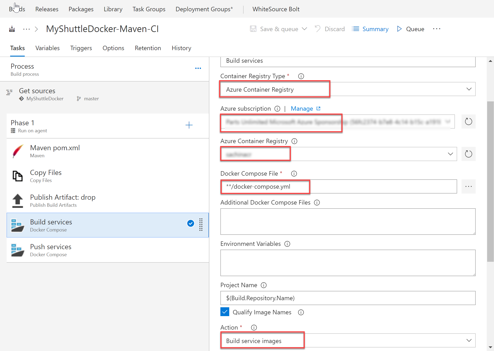

1. Select the other  **Docker Compose** task you added and provide the same settings (you can also right-click the previous tasks and select *clone* ). Change the **Action** to **Push Service Images**. This action will instruct the task to push the container image to a container registry

      

1. The build definition is complete and is ready to run. You will need to specify a build agent to execute this. You will use a hosted Linux agent. Select the **Process** section and choose **Hosted Linux Preview** for the Agent queue.

1. Click the **Save and Queue** button to save and queue this build. It may take a couple of minutes for the build to find an agent to run. Once it gets an agent, the build starts executing. You can see the output logs in real-time as the build is running. You can also download the log later should you need to a deeper analysis.

    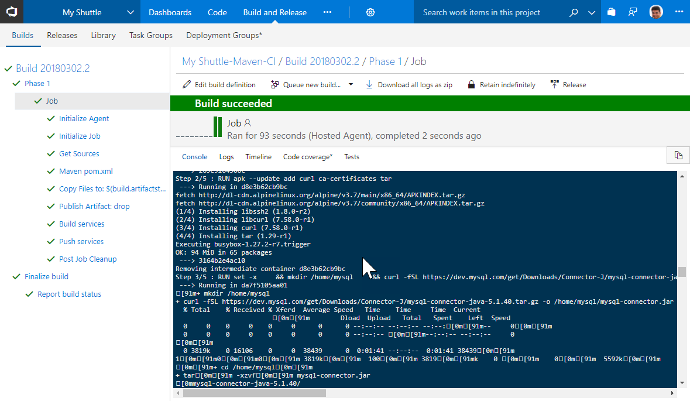

1. Wait for the build to complete. When it is successful you can go to your Azure portal and verify if the images were pushed successfully. 
    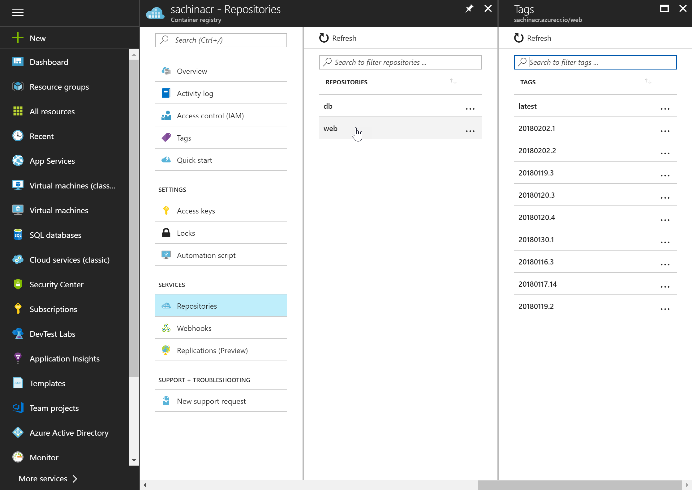

## Exercise 4: Deploying to an Azure Web App for containers

In this exercise, you will setup a release definition to deploy the web application to an Azure web app. First, you need to create an **Azure Web App for containers** to deploy and run the containerized web app. 

1. Go to the Azure portal - https://portal.azure.com. Choose **New, Web + Mobile** and then choose **Web App for Containers**

     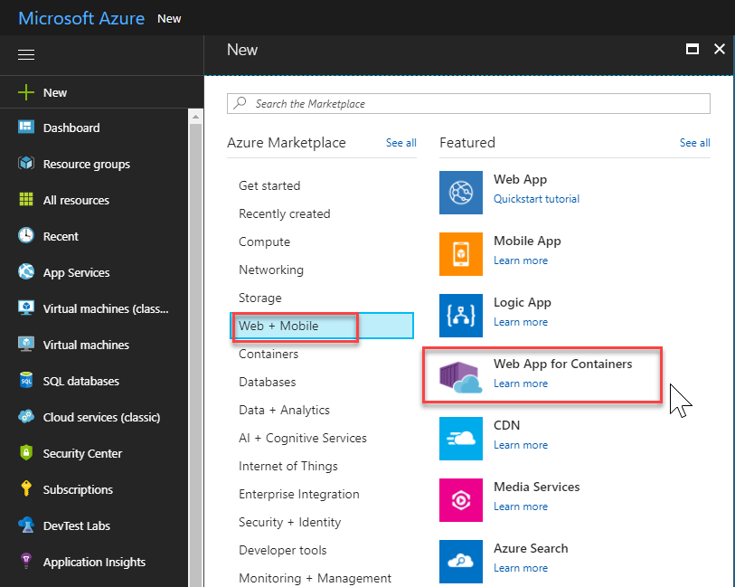

1. Provide a name for the new web app, select existing or create new resource group for the web app. Then select **Configure Container** to specify the source repository for the images. Since we are using ACR to store the images, select **Azure Container Registry**. Select the **Registry**, **Image** value as **web** and **Tag** with the latest build value from the drop-downs. Select **OK** and then select **Create** to start provisioning the web app

    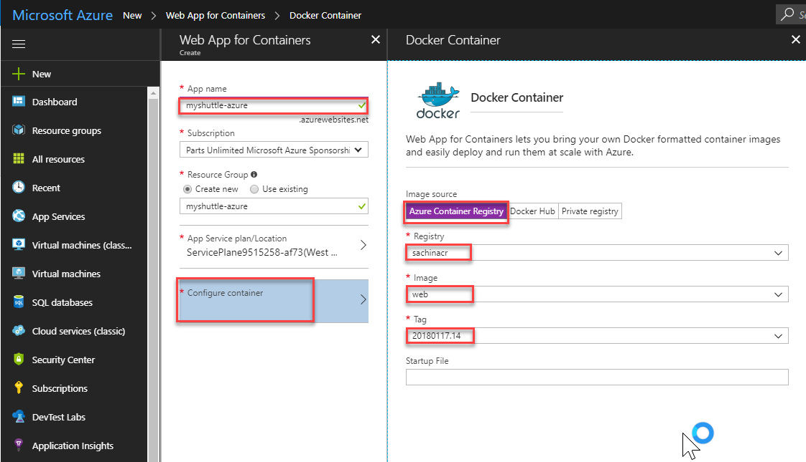

    > We could configure *Continuous Deployment* to deploy the web app is updated when a new image is pushed to the registry, within the Azure portal itself. However, setting up a Team Services CD pipeline will provide more flexibility and additional controls (approvals, release gates, etc.) for application deployment

1. Go back to Team Services and select **Releases** from the **Build and Release** hub. Select **+** and then **Create Release Definition**

1. Select the **Azure App Service Deployment** template and click **Apply**

1. Select **Pipeline**. Click **+Add** to add the artifacts. Select **Build** for the source type. Select the **Project**, **Source** and the **Default version**.  Finally select **Add** to save the settings

1. Open the environment. Select **Environment 1** and configure as follows

    * Pick the Azure subscription
    * Select **Linux App** for the **App Type**
    * Enter the **App Service** name that you created
    * Enter the **Azure Container Registry** server URL for **Registry or Namespace** and then
    * Enter ***Web*** for the **Repository**

    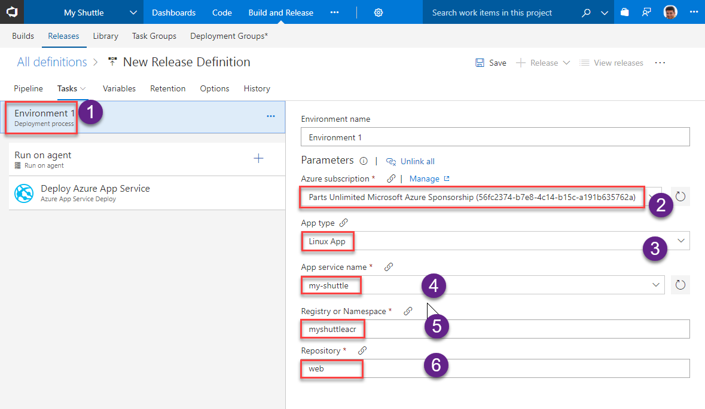

1. Select the **Deploy Azure App Service** task and make sure that these settings are reflected correctly. Note that the task allows you to specify the **Tag** that you want to pull. This will allow you to achieve end-to-end traceability from code to deployment by using a build-specific tag for each deployment. For example, with the Docker build tasks  you can tag your images with the Build.ID for each deployment.

    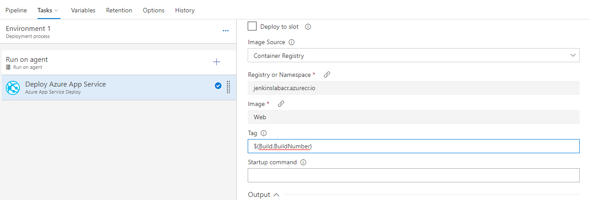

1. Select **Save** and then click **+ Release**  \| **Create Release** to start a new release

1. Check the artifact version you want to use and then select **Create**

1. Wait for the release is complete and then navigate to the URL `http://{your web app name}.azurewebsites.net/myshuttledev`. You should be able to see the login page

## Optional: Setting up MySQL database

This application requires a MySQL database and in this optional exercise, you will setup a MySQL database on Azure

1. From the Azure portal, select **+ New** and search for **MySQL**. Choose **Azure Database for MySQL(preview)** from the filtered result list and click **Create**. 

    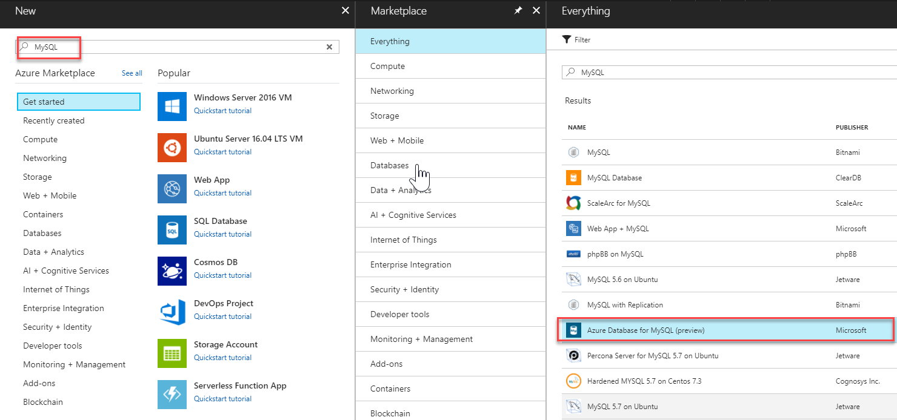

1. Enter all required information and select **Create**

    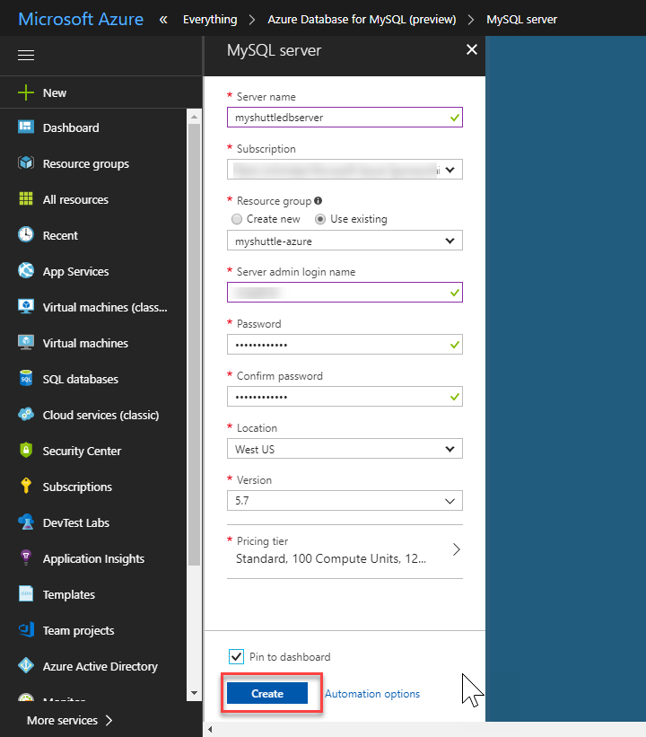

1. Navigate to **Connection Security** section, enable **Allow Access to Azure Services** and click **Save**. Select **Properties**. Note down **SERVER NAME** and **SERVER ADMIN LOGIN NAME**

1. In this example, the server name is **myshuttle-1-mysqldbserver.mysql.database.azure.com** and the admin user name is **mysqldbuser@myshuttle-1-mysqldbserver**

1. We will use the MySQL command-line tool to establish a connection to the Azure Database for MySQL server. We will run the MySQL command-line tool from the Azure Cloud Shell in the browser. To launch the Azure Cloud Shell, click the `>_` icon in the top right toolbar and choose **Bash** if given an option to choose the shell type.

1. Enter the following command

    ```HTML
    wget https://raw.githubusercontent.com/hsachinraj/azure-arm-templates/master/vstsazurejl_arm/mydbscript.script
    ```
    This should download the file that we want to execute on the server

1. Next, we will execute the SQL from the downloaded file on the database server. Enter the following command
    ````SQL
    mysql -h myshuttle-1-mysqldbserver.mysql.database.azure.com -u mysqldbuser@myshuttle-1-mysqldbserver -p < mydbscript.script
    ````
    Enter the password that you specified during provisioning the database

    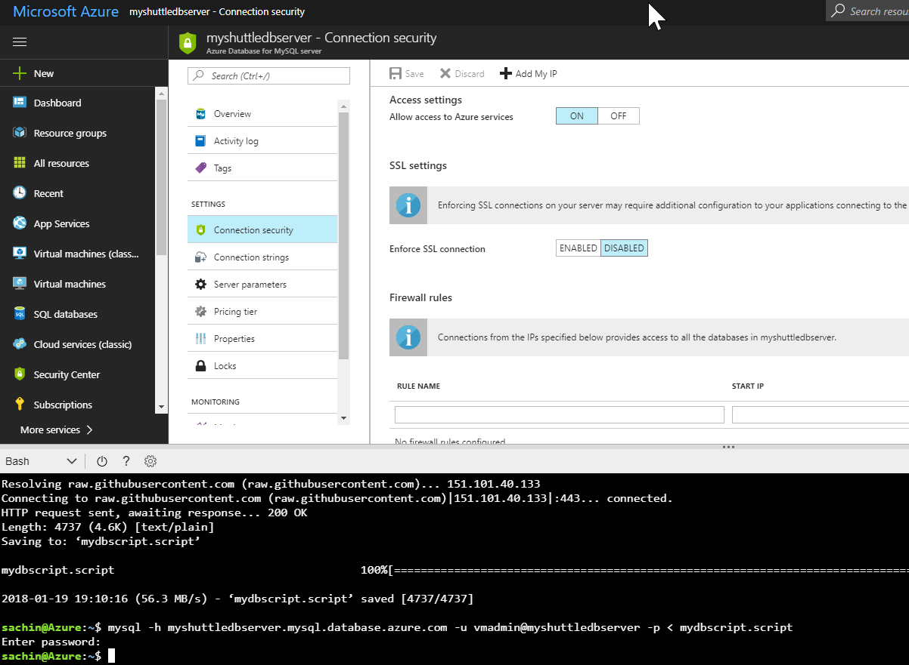

    >This should create the database, tables and populate records for us. 

1. Next, navigate to the Web app that you have created. Click **Application Settings** and scroll down to the **Connection Strings** section

1. Add a new MySQL connection string with **MyShuttleDb** as the name and the following string for the value - `jdbc:mysql://{MySQL Server Name}:3306/alm?useSSL=true&requireSSL=false&autoReconnect=true&user={your user name}&password={your password}`

1. Click **Save** to save the connection string

   

    ````Java
    String conStr = System.getenv("MYSQLCONNSTR_MyShuttleDb");
    ````

You have now setup and configured the database needed to deploy and run the MyShuttle application.

1. You should be able to login to the application now. Return back to the login page and try logging is using any of the username/password combination:

    * *fred/fredpassword*
    * *wilma/wilmapassword*
    * *betty/bettypassword*

## Additional Hands-on Labs

If you want to learn more on how you can implement modern DevOps practices with  Team Services and Azure - see [Microsoft VS DevOps Hands-on Labs](https://almvm.azurewebsites.net/)


