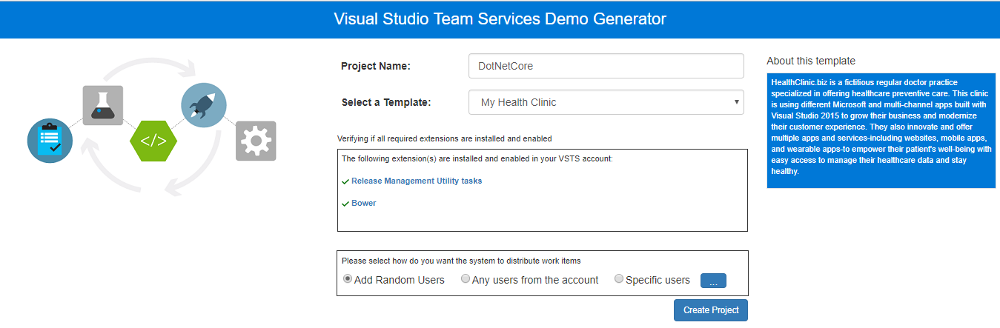
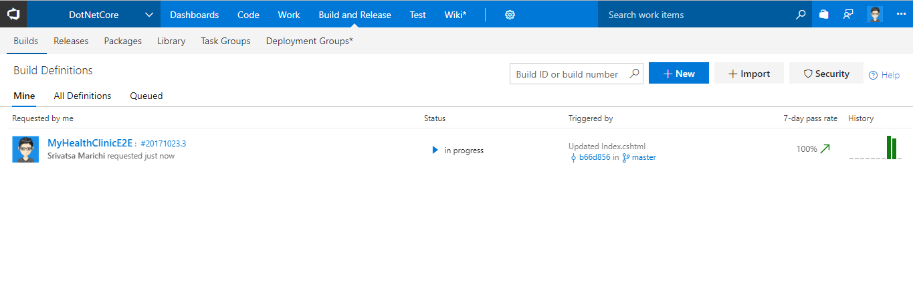
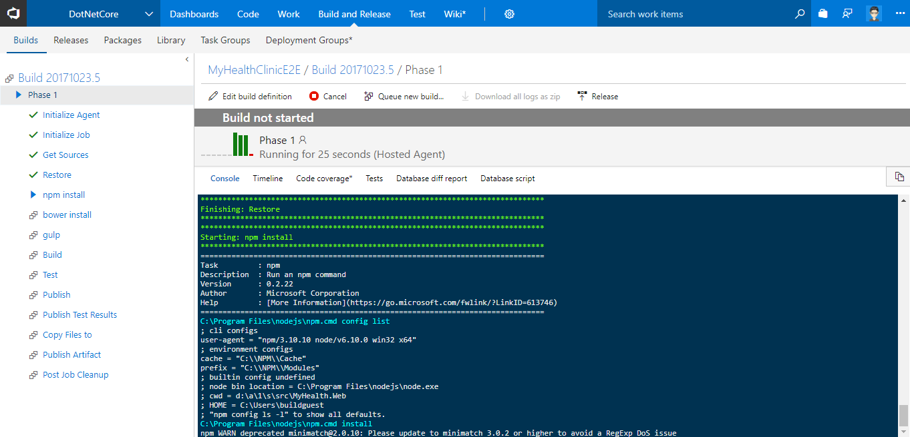
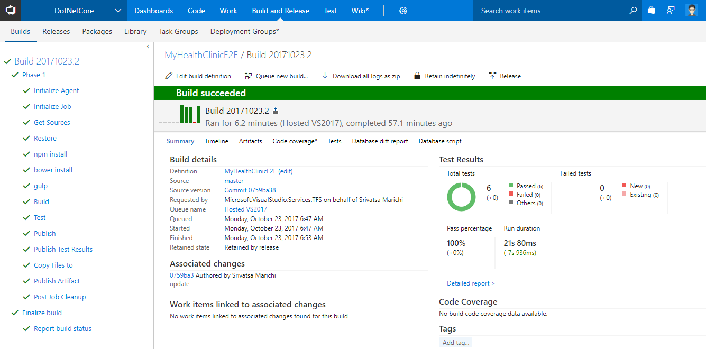
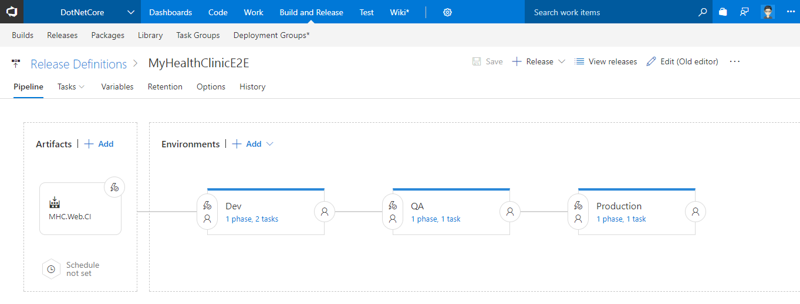
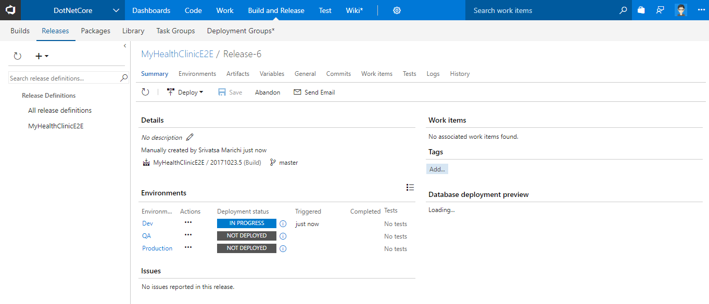
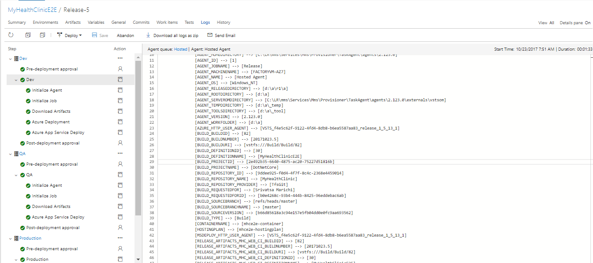
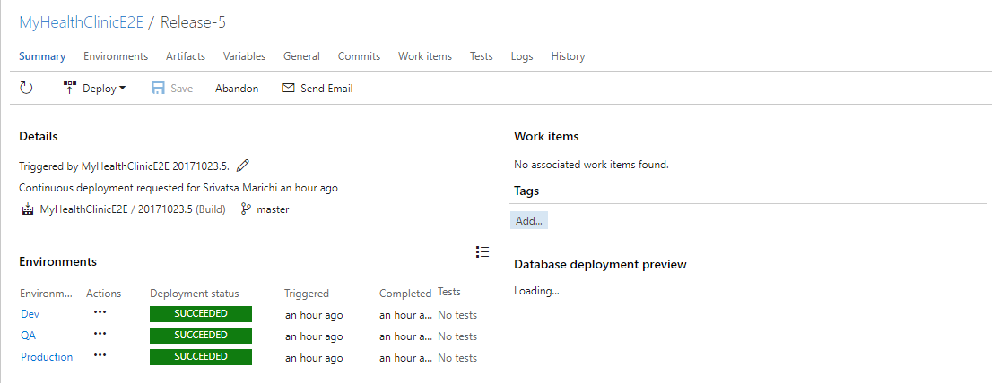

## Deploy an .NET Core application to Azure App Service using Team Services

This lab shows how you can deploy an **.NET Core application to Azure App Service using an CI/CD pipeline in Visual Studio Team Services**.

## Pre-requisites

1. **Microsoft Azure Account:** You will need a valid and active azure account for the labs

2. You need a **Visual Studio Team Services Account** and <a href="http://bit.ly/2gBL4r4">Personal Access Token</a>

## Setting up the project

1. Use <a href="https://vstsdemogenerator.azurewebsites.net" target="_blank">VSTS Demo Data Generator</a> to provision a project on your VSTS account.

   

2. Select **MyHealthClinic** for the template.

   

3. Once the project is provisioned, select the URL to navigate to the project that you provisioned.

## Configuring the CI/CD pipeline

1. Let's start from code. Navigate to the **Code** hub.

   

2. We have an **ASP.NET CORE** app code provisioned by the demo generator system. We will deploy this to Azure app service.

3. We have a Continious Integration (CI) build setup to run upon a code commit. Let's make a simple change to the code to trigger the CI build.

4. Open the file **Index.cshtml** by navigating to the below path-

   > **MyHealthClinic/src/MyHealth.Web/Views/Home/Index.cshtml**

   

5. Edit the code. For this example, let's change **line 33** to change the text from **Login** to **Private Area**.

   

6. Select **Commit** to save and commit the changes.

7. The code commit will trigger the CI build. Go to the **Build** tab to see the CI build running in progress.

   

   While the build is in progress, let's explore the build definition. Below is the table which gives you the glimpse of the tasks that is being used in the current build definition.

   <table width="100%">
   <thead>
      <tr>
         <th width="50%"><b>Tasks</b></th>
         <th><b>Usage</b></th>
      </tr>
   </thead>
   <tr>
      <td><a href="http://bit.ly/2xXy75z"><b>dotnet core</b></a> </td>
      <td>restores, build, test, publish and run NuGet Packages/Dependencies for the solution using dotnet command-line tool </td>
   </tr>
   <tr>
      <td><a href="http://bit.ly/2xZO6zZ"><b>npm Install</b></a>  </td>
      <td>used to restore javascript packages/dependencies </td>
   </tr>
   <tr>
      <td><a href="http://bit.ly/2yDYzAy"><b>Bower Install</b></a>  </td>
      <td>is a package manager for web </td>
   </tr>
   <tr>
      <td><a href="http://bit.ly/2zw0ggf"><b>Gulp</b></a>  </td>
      <td>gulp is a toolkit for automating time-consuming tasks in your development workflow </td>
   </tr>
   <tr>
      <td><a href="http://bit.ly/2l9xkbI"><b>Publish Test Results</b></a>  </td>
      <td>used to publish test results including the formats for <b>JUnit, NUnit2, VSTest, NUnit3 and xUnit2</b> </td>
   </tr>
   <tr>
      <td><a href="http://bit.ly/2grMxTQ"><b>Copy Files</b></a>  </td>
      <td>Used to Copy files from source to destination folder using match patterns </td>
   </tr>
   <tr>
      <td><a href="http://bit.ly/2yBgXde"><b>Publish Build Artifacts</b></a>  </td>
      <td> Used to share the build artifacts </td>
   </tr>
   </table>
    

   

8. Once the build is completed, you can see the summary which shows **test results** etc as shown below.

   

## Continuous Delivery

We have a release pipeline configured to deploy the application. It is associated to the build and triggered when the build is successful. Let's look at the release pipeline.

1. Navigate to the **Releases** tab under **Build and Release** hub.

2. Select the **MyHealthClinicE2E** definition and choose **Edit**.

3. We have three environments **Dev**, **QA** and **Production**.

   

4. Go to the **Dev** environment, you can see we have 2 tasks being used. Below is the table which gives you the glimpse of the tasks that is being used in the current release definition.

   <table width="100%">
   <thead>
      <tr>
         <th width="57%"><b>Tasks</b></th>
         <th><b>Usage</b></th>
      </tr>
   </thead>
   <tr>
      <td><a href="http://bit.ly/2ysg1It"><b>Azure Resource Group Deployment</b></a> </td>
      <td>Creates, Updates an existing resource group using ARM templates  </td>
   </tr>
   <tr>
      <td><a href="http://bit.ly/2zkks4L"><b>Azure App Service Deploy</b></a>  </td>
      <td>Updates Azure App Service to deploy WebApps </td>
   </tr>
   <tr>
   </table>

We are using **Infrastructure as a Code** in the release pipeline with an ARM template to provision the required infrastructure **(Web App and SQL database)** on Azure.

5. You can see in progress release as shown below.

   

6. Once the release is completed, you can see the summary which shows **Release Summary, logs etc**.

   

   

7. Login to [Azure Portal](https://portal.azure.com) and search a **Resource Group** with the name **dotnetcore** that would have got created. It would be associated with few other resources like **SQL server, SQL DB, WebApps** etc as shown below.

   

8. Navigate to one of the WebApp from the resource group and you should see the application is deployed successfully with the changes made earlier as shown.

   

