## Continuous Integration with GitHub and Visual Studio Team Services

This hands-on lab is created to introduce you to open source DevOps using **GitHub, Visual Studio Team Services** and **Azure**.
The lab showcases how to deploy an **ASP.Net** application to Azure App Service using CI/CD pipeline in Visual Studio Team Services with code repository in GitHub.

## Pre-requisites

1. **Microsoft Azure Account:** You will need a valid and active azure account for the labs

2. You need a **Visual Studio Team Services Account** and <a href="http://bit.ly/2gBL4r4">Personal Access Token</a>

3. A **GitHub** account. If you don't have one already, you can setup <a href="https://github.com/join?source=header-home">GitHub Account</a> for free.

## Introduction

**GitHub** is a web-based Git or version control repository. It offers all of the distributed version control and source code management (SCM) functionality of Git as well as adding its own features but it doesn't have an integrated build server.

We can overcome this shortfall by using **Visual Studio Team Services (VSTS)** as a continuous integration platform for Github. This lab will demonstrate how to achieve this using the following steps:

- Fork project repository to your github account
- Link the GitHub account to VSTS
- Editing the existing Build Definition to include source code from GitHub
- Configure the Triggers
- Execute the Build

### Application setup on GitHub

You need to fork the application repository from GitHub in order to use it for this lab so that the VSTS CI can find it.

#### Fork GitHub Repository

Go to the repository on **GitHub** and make sure you are logged in with your GitHub user account.

>Fork the repository from "https://github.com/Hoyg/PartsUnlimited/" to your GitHub account.

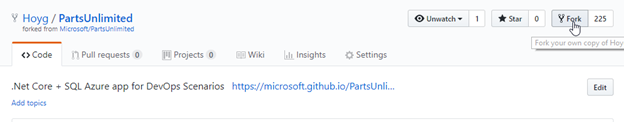

#### Setting up VSTS project

1. Use <a href="https://vstsdemogenerator.azurewebsites.net" target="_blank">VSTS Demo Data Generator</a> to provision a project on your VSTS account.

   

2. Select **PartsUnlimited** for the template.

   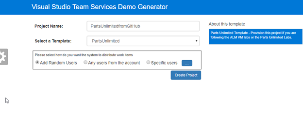

3. Once the project is provisioned, select the URL to navigate to the project that you provisioned.

   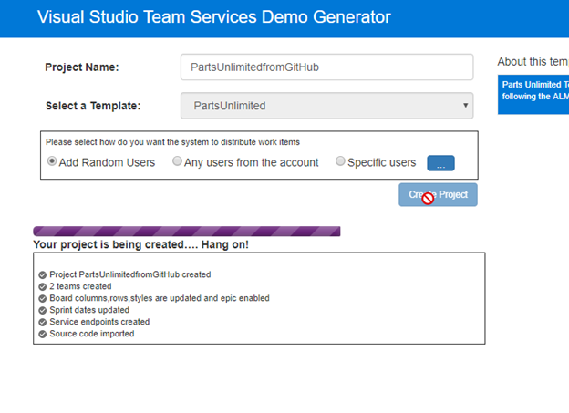

#### Connecting VSTS to GitHub repository

1. Navigate to the project dashboard and navigate to **Services** under **Settings**.

   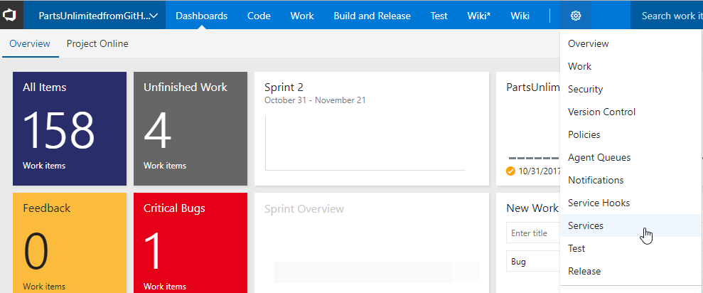

2. Create a new GitHub connection by clicking on **+ New Service Endpoint** and selecting **GitHub**.

   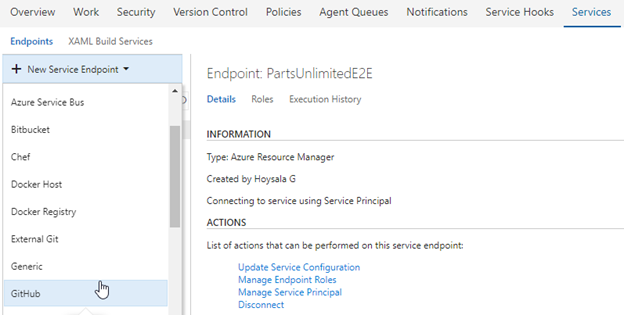  

3. Click on the **Authorize** button and follow the steps required by GitHub to authorize access to your account. 

   
   
   **Since the authorization is in a new pop-up window, you have to unblock the pop-up window (if applicable) in your browser**

4. When access is granted, you will see a message that confirms the connection and you can name the connection and Click OK.

   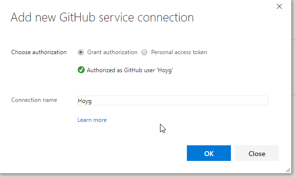

5. You will now see the service endpoint that you created in the overview.

   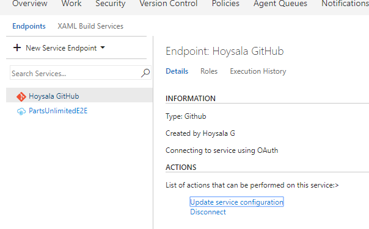

#### Configuring the VSTS build definition to use GitHub as source and enable CI
        
1. Go to **Builds** under **Build & Release**.

   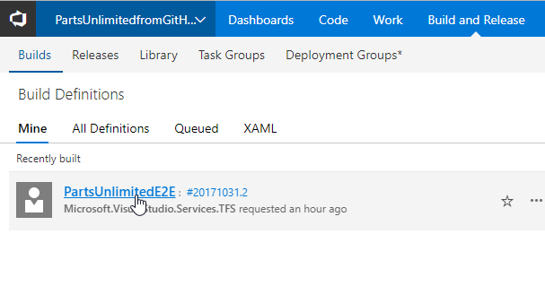

2. For the build definition **PartsUnlimitedE2E**, click on **Edit**.

   

3. Click on **Get Sources** under the Tasks tab.
Select **GitHub** as the source, confirm that the service endpoint connection created in #2 shows up, select it.

   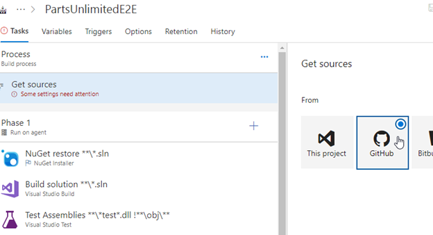

4. Choose the Repository and the **aspnet45** branch.

   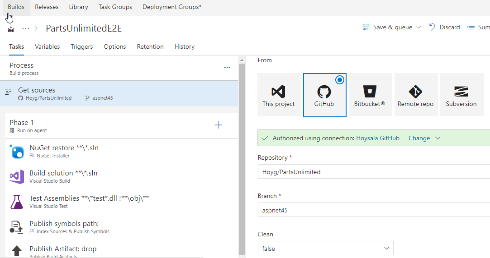

6. Navigate to **Triggers** menu and enable **Continuous Integration**.

   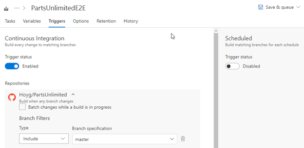

7. Save the build definition.
        

#### Edit Code and check CI build success
                
Let's start from code. Navigate to the GitHub.
We have an ASP.NET app code provisioned by the demo generator system. We will deploy this to Azure app service.

We have a Continuous Integration (CI) build setup to run upon a code commit. Let's make a simple change to the code to trigger the CI build.

1. Open the file **Index.cshtml** under **aspnet45** branch by navigating to the below path-

   >PartsUnlimited-aspnet45/src/PartsUnlimitedWebsite/Views/Home/Index.cshtml

   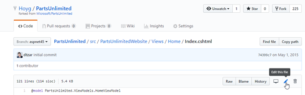

   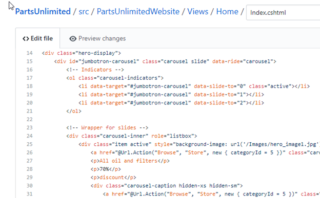

2. Edit the code. For this example, let's change **line 28** to increase discount **from 20%** to **70%**.

3. Navigate to **Preview changes**, enter a commit message and click on **Commit Changes**.

   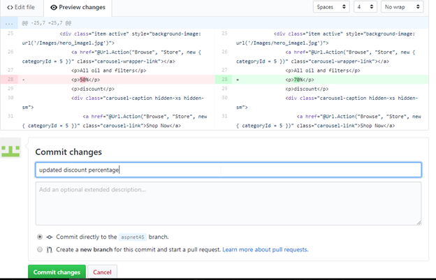

4. The code commit will trigger the CI build. Go to the **Build** tab to see the CI build running in progress.

5. Once the build is completed, you can see the summary which shows **test results, code coverage** etc.

   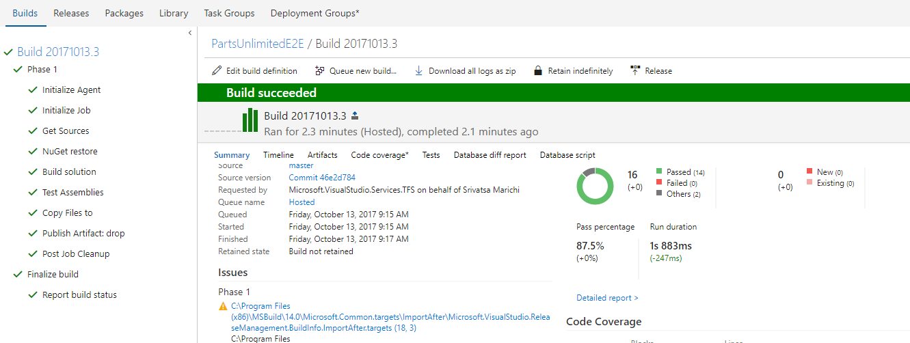

