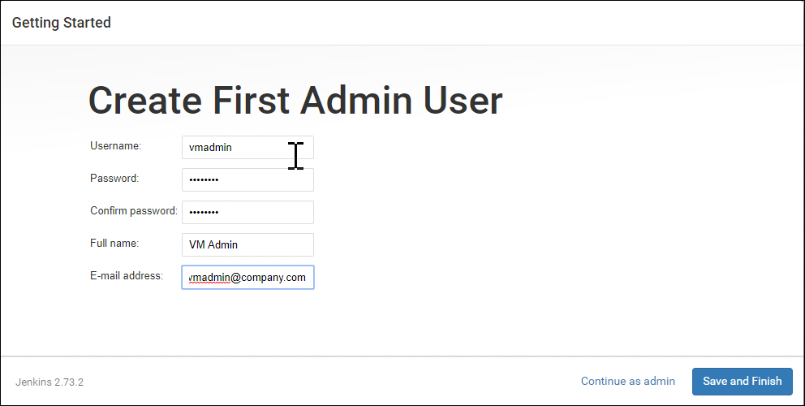
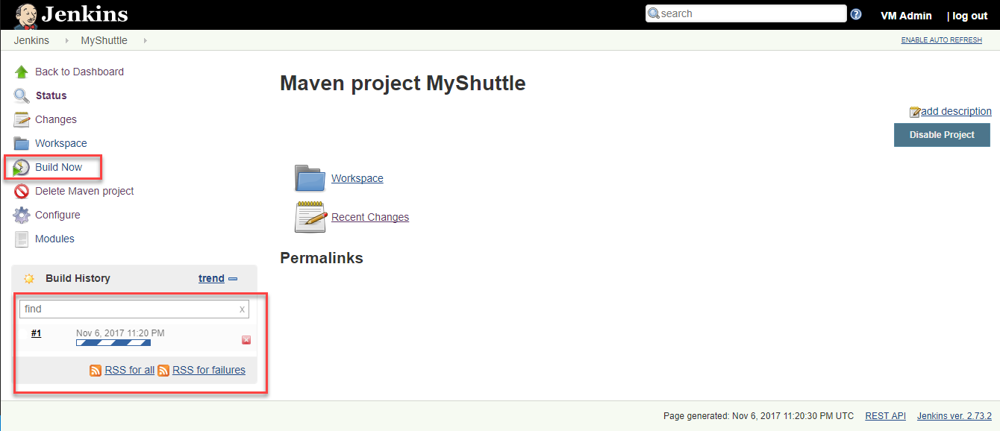

## Working with Jenkins

This lab shows how you can integrate Team Servcies and Jenkins. You can store your code in VSTS and continue to use Jenkins for your continuous integration builds. We will see how you trigger a Jenkins build when you push code to your team project's Git repository or when you check code in to Team Foundation version control

## Pre-requisites
1. Microsoft Azure Account:</b> You will need a valid and active azure account for the labs.

1.  You need a <b>Visual Studio Team Services Account</b> and <a href="http://bit.ly/2gBL4r4">Personal Access Token</a>

1. You will need Putty

## Setting up the project

1. Use <a href="https://vstsdemogenerator.azurewebsites.net" target="_blank">VSTS Demo Data Generator</a> to provision a project on your VSTS account 

 2. Select **MyShuttleJenkins** for the template

## Setting up Jenkins VM
1. Lets set up a Jenkins VM on Azure. We will use the VM image available on Azure MarketPlace

    
    
 
1. Once the machine is provisioned, selct **Connect** and note down the connection string. This should be in a <username>@<ip address> format. We will need this to conenct from Putty
    

1. Open a commannd prompt and type the following command
    > putty.exe -ssh -L 8080:localhost:8080 \<username>@\<ip address>

    

1. Login with the user name and password that you provided when you provisioned the VM.

1. Once you are connected successfully, 

1. Open a browser and type [http://localhost:8080](http://localhost:8080)

1. Since this is the first time you are connecting to Jenkins, you will need to enter the initial password. Return to the putty terminal password and type the following command 
    >sudo nano /var/lib/jenkins/secrets/initialAdminPassword

1. Press **Ctrl+K** to cut the text and place it in the clipboard. Press **F2** to exit the nano editor 

1. Back in the browser, paste the text and select **Continue**
    

1. Choose **Install suggested plugin** to install the default plugin. We will need to add Maven plugin but we will see that later in the lab.
    
    
1. You will need to create a new *Admin* user for Jenkins. Provide a user name and password and select **Continue**
    

1. Now, you have Jenkins ready to use. Select **Start using Jenkins**
    

## Installing and configuring Maven

Since Maven plugin is not automatically installed by default starting from Jenkins 2, we will need to do this manually

1. Select **Manage Jenkins** on the main page of the Jenkins portal.  This will take you to the Manage Jenkins page, the central one-stop-shop for all your Jenkins configuration. From this screen, you can configure your Jenkins server, install and upgrade plugins, keep track of system load, manage distributed build servers, and more! 

1. Select **Manage Plugins** 

    

1.  Select **Available** tab and search **maven-plugin** in the filter box

1. Check **Maven Integration Plugin** and selct **Install without restart** to install the plugin. Wait for the plug-in to be installed.
    

1. Select **Manage Jenkins** and select **Global Tool Configuration**

    

1.  We have added the Maven plugin for Jenkins but we have not installed Maven on the machine. Jenkins provides great out-of-the-box support for Maven.  We could  manually install Maven by extracting the ***tar*** file located in a shared folder. Alternatively, we can let Jenkins do all the hardwork and download Maven for you. Select the **Install automatically** checkbox. Jenkins will download and install Maven from the Apache website the first time a build job needs it. 

    We will install version 3.5, the latest version at the time the lab is written
    

1. Click **Apply** and select **Back to Dashboard** to return to the home page. 

## Creating a new CI definition

1. From Jenkins home page, select **New Item**. Enter a name for the build definition, and select **Maven project**. Click **OK** to save 
    

 1. Scroll down to the **Source code Management** section. Select **Git** and Enter the clone URL of your VSTS Git repo. It should be in http://<your account name>.visualstudio.com/<your project name>/_git/MyShuttle

    

    VSTS Git repos are private. So you will need to provide the credentials to access the repository. If you have not set the Git crednetials, you can do it from VSTS
    
    
1. Select **Add | Jenkins** to add a new credential. Save the user name and password and click **Add** to close the wizard
    

1. Select the credential from the drop-down. The error message should disappear now 
    

1. The source code for this application has both unit tests and UI tests. We will include the unit tests but skip the UI tests from running now.

1. Scroll down to the **Build Settings** section. Enter the following text in the **Goals and Options** field

    >package -Dtest=FaresTest,SimpleTest

1. Click **Save** to naviagate to the main page of the project you just created
    

1. Select **Build Now** to start an Ad-hoc build

1. You will notice the build progress just below the left side navigation menu
    

1. You can select the build number to get into the details of the build including the build artifacts, in this case, the WAR file for the project.
    
    

1. Select the **Test Results** links if you want to see the results of the unit tests that we included in the build defintion. 

## Configuring the build as Continuous Integration

In this section, let's see how you can configure a code change in VSTS to trigger a build in Jenkins

1. Go to your VSTS project page and navigate to the admin  **Service Hooks** page

    

1. Select **Create subscription** button

1. In the *New subscriptions dialog* select **Jenkins** and click **Next**
    

1. Select **Code pushed**  for the **Trigger on this of type event**

1. Make sure you have selected the **MyShuttle** (or the correct repo) for which you have configured the build

1. Select **Next**

    

1. In the next page, select **Trigger generic build** for the perform action field

1. Enter the URL of the Jenkins server in **http://ipaddress or domainname format

1. Enter **User name** and **Password** that you have setup for Jenkis

1. Select **Test** to check the settings. If the settings are correct, click **Finish** to save and exit
    
    

Now you can try making a change and commit your code. Upon commit, VSTS will notify Jenkins to initiate a new build/

## Deploying Jenkins Artifacts with Release Management

You can Visual Studio Team Services Release Management to fetch the artifacts from the Jenkins server and deploy them. In this exercise below, we will configure VSTS to deploy the WAR file to Azure Web App Service. 

1. First, we will need to create an endpoint to Azure and the Jenkis server. From the **Admin | Services** tab, select the **New Service Endpoint | Jenkins** button to create a new endpoint

2. Provide the server URL and the user name and password (the credentials you provided for the first admin user). The server URL is in http://[server IP address or DNS name] format. Click **Verify Copnnection** to validate the entries and to confirm that VSTS is able to reach the Jenkins server
    

1. Create a new Azure endpoint

1. Once you the have the endpoints configured, you can create a new release defintion. Select the **Build & Release** hub and select **+ Create a new Release defintion**

2. 

