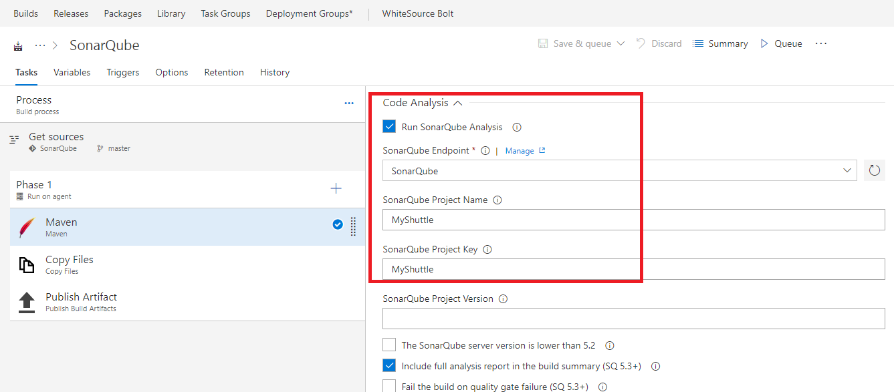
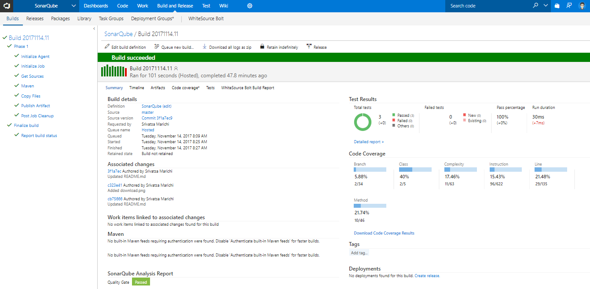
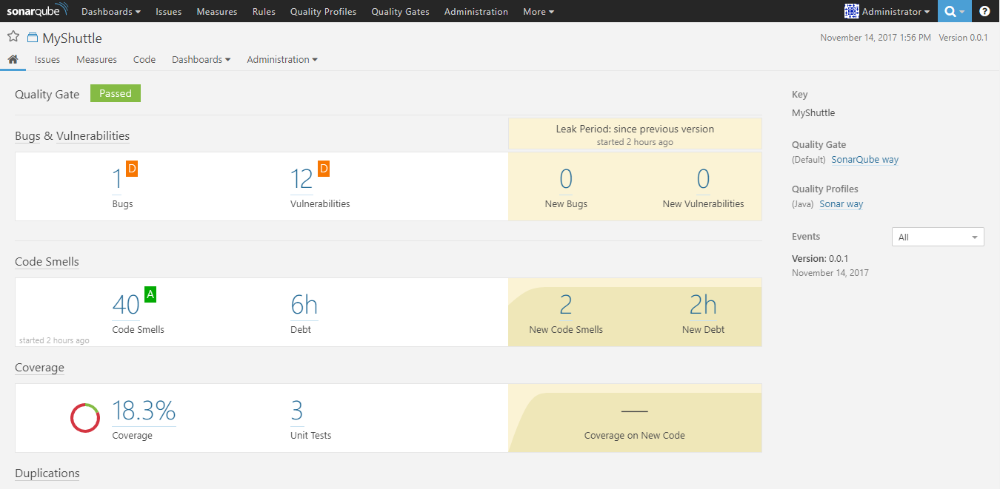

## Managing Technical Debt with Visual Studio Team Services and SonarQube 

In this lab, you will be introduced to Technical debt, how to configure your Team Build Definitions to use SonarQube, how to understand the analysis results and finally how to configure quality profile to control the rule set used by SonarQube for analyzing your project.

## Pre-requisites

1. **Microsoft Azure Account:** You will need a valid and active azure account for the labs

2. You need a **Visual Studio Team Services Account** and <a href="http://bit.ly/2gBL4r4">Personal Access Token</a>

3. You will need a **SonarQube** server

## Setting up the project

1. Use <a href="https://vstsdemogenerator.azurewebsites.net" target="_blank">VSTS Demo Data Generator</a> to provision a project on your VSTS account.

   

2. Select **SonarQube** for the template.

3. Once the project is provisioned, select the URL to navigate to the project that you provisioned.

## Setting up SonarQube Server on Azure

1. Click on **Deploy To Azure** to spin up a SonarQube Server on Azure VM.

   

   Provide the following valid parameters as shown in the table.

   <table width="100%">
   <thead>
      <tr>
         <th width="50%"><b>Parameter Name</b></th>
         <th><b>Description</b></th>
         
      </tr>
   </thead>
   <tr>
      <td>sqVM_AppName</td>
      <td>Name of the VM that SonarQube will be installed upon</td>
      
   </tr>
   <tr>
      <td>sq_PublicIP_DnsPrefix</td>
      <td>The prefix of the public URL for the VM on the Internet (Max 63 chars, lower-case). It should match with the following regular expression: ^[a-z][a-z0-9-]{1,61}[a-z0-9]$ or it will raise an error. This will be used to build the fully qualified URL for the SonarQube site in the form of http://[sq_PublicIP_DnsPrefix].[AzureRegion].cloudapp.azure.com Ex: A value of "my-sonarqube" will result in a URL of http://my-sonarqube.eastus.cloudapp.azure.com if the ARM template is deployed into a storage account hosted in the EASTUS Azure region</td>
      
   </tr>
   <tr>
      <td>sqVM_AppAdmin_UserName</td>
      <td>Local Admin account name for the SonarQube VM</td>
      
   </tr>
   <tr>
      <td>sqVM_AppAdmin_Password</td>
      <td>Password for the SonarQube VM Local Admin account</td>
      
   </tr>
   <tr>
      <td>sqDB_Admin_UserName</td>
      <td>Admin account name for Azure SQL Server</td>
      
   </tr>
   <tr>
      <td>sqDB_Admin_Password</td>
      <td>Password for Azure SQL Server Admin account</td>
      
   </tr>
   
   </table>

2. Once the deployment is successful, you should see all the resources in the resource group in Azure Portal.

   

3. Access the **SonarQube** portal by providing its public address in the browser. The address format is **http://[sq_PublicIP_DnsPrefix].[AzureRegion].cloudapp.azure.com:9000**.

   >You can login to the SonarQube Portal using the following credentials- **Username= admin, Password= admin**

   

## Configure SonarQube Server

1. Login to the portal with the above mentioned credentials.

2. Click on **Administration** and go to **Projects-->Management**

   

3. Create Project as shown with the following details.

   

## Configuring CI pipeline for SonarQube

1. We have a **Java** Application provisioned by the demo generator system. We will run the analysis for the same.

2. Open the build definition **SonarQube** to explore the tasks. The tasks that is used in the build definition are listed in the table below.

   <table width="100%">
   <thead>
      <tr>
         <th width="50%"><b>Tasks</b></th>
         <th><b>Usage</b></th>
      </tr>
   </thead>
   <tr>
      <td><a href="http://bit.ly/2lvftfo"><b>Maven</b></a> </td>
      <td>Used to build Java code</td>
   </tr>
   <tr>
      <td><a href="http://bit.ly/2grMxTQ"><b>Copy Files</b></a>  </td>
      <td>Used to Copy files from source to destination folder using match patterns </td>
   </tr>
   <tr>
      <td><a href="http://bit.ly/2yBgXde"><b>Publish Build Artifacts</b></a>  </td>
      <td> Used to share the build artifacts </td>
   </tr>
   </table>

3. Configure the **Maven** task with **SonarQube Endpoint, Project Name, Project Key** as shown below.

   >We have a built in Code Analysis support for maven task and hence we are using the same in our analysis

   

3. Save and trigger the build to see the in progress status.

   

4. Once the build is completed, you can see the summary which shows **Test Results, Code Coverage, SonarQube Analysis Report** as shown below.

   

5. Navigate to **SonarQube** Portal by providing its public address to see the analysis results by selecting the project.

   

   

   

