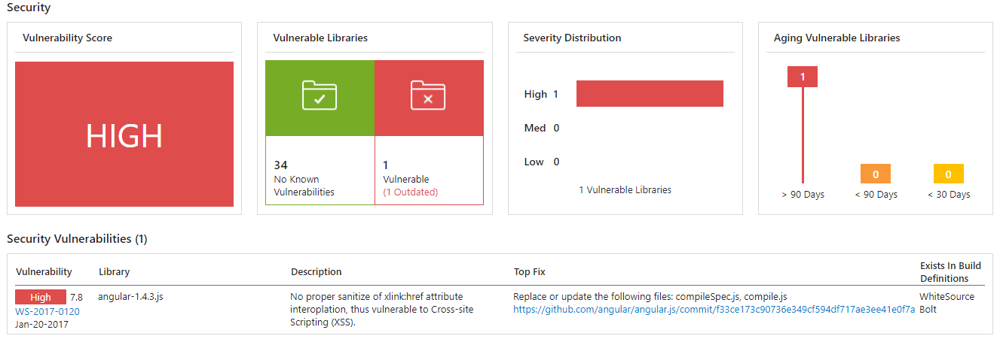

## Checking Vulnerabilities using WhiteSource Bolt with Visual Studio Team Services

## Overview

This lab shows how you can use <a href="https://www.whitesourcesoftware.com/"  target =_blank>WhiteSource</a> with VSTS to automatically detect and alerts on vulnerable open source components, outdated libraries, and licenses compliance issues in your code. We will be using WebGoat, a deliberately insecure web application maintained by OWASP designed to teach web application security lessons.

Team Services integration with WhiteSource Bolt will enable you to:

1. Detect and remedy vulnerable open source components.
2. Generate comprehensive open source inventory reports per project or build.
3. Enforce open source license compliance, including dependencies’ licenses.
4. Identify outdated open source libraries with recommendations to update.

For more information, visit <a href="http://docs.whitesourcesoftware.com/display/serviceDocs/WhiteSource+Bolt" target =_blank>here</a>

## Pre-requisites

1. You need a Visual Studio Team Services Account and <a href="https://docs.microsoft.com/en-us/vsts/accounts/use-personal-access-tokens-to-authenticate"  target =_blank>Personal Access Token</a>
 
 2. You need to install the **Whitesource Bolt** extension from <a href="https://marketplace.visualstudio.com/items?itemName=whitesource.ws-bolt" target=_blank> Visual Studio Marketplace</a>

## Setting up the VSTS project

1. Use <a href="https://vstsdemobuildersite.azurewebsites.net/?name=whitesource%20bolt" target="_blank">VSTS Demo Data Generator</a> to provision the  WhiteSource project on your VSTS account.

## Exercise 1: Activate WhiteSource Bolt

In your Team project, under **Build and Release** section, go to **White Source Bolt** tab and activate **14 days** trial license.

If you are an active MSDN subscriber, click here to get key from your <a href="https://my.visualstudio.com/Benefits?wt.mc_id=o~msft~profile~devprogram_attach&workflowid=devprogram&mkt=en-us" target=_blank> Dev Essentials page</a>

 

Upon activation, the below message is displayed.

## Exercise 2: CI Build

We have a **Java code** provisioned by the demo generator system. We will use **WhiteSource Bolt** extension to check the vulnerable components present in this code.

1. Go to **Build and Release** tab and check if the build is triggered.

   

2. You can see the build in progress status. 

   

3. While the build is in progress, let's explore the build definition. The tasks that is used in the build definition are listed in the table below.

    <table width="100%">
   <thead>
      <tr>
         <th width="50%"><b>Tasks</b></th>
         <th><b>Usage</b></th>
      </tr>
   </thead>
   <tr>
      <td><a href="http://bit.ly/2lvftfo"><b>Maven</b></a> </td>
      <td>builds Java code </td>
   </tr>
   <tr>
      <td><a href="http://bit.ly/1Vxz1Jb"><b>WhiteSource Bolt</b></a>  </td>
      <td>scans the code to detect security vulnerabilities, problematic open source licenses</td>
   </tr>
   <tr>
      <td><a href=""><b>Copy Files</b></a>  </td>
      <td>copies files from source to destination folder using match patterns </td>
   </tr>
   <tr>
      <td><a href=""><b>Publish Build Artifacts</b></a>  </td>
      <td>shares the artifacts produced by the build </td>
   </tr>
   </table>

4. Once the build is completed, you will see the summary which shows **test results, code coverage** as shown below.

   

5. From the build summary, go to **Whitesource Bolt Build Report** to see the vulnerability report.

   

## Analyse Reports

Now that we have the report generated, lets analyse them one by one.

# TBA

### Security

This report show the list of all vulnerable open source components with **vulnerability score, vulnerable libraries, description** and **top fix.**

### Outdated Libraries
 
This report shows a comprehensive list of all your Outdated Libraries, including versions and recommendations.

### Inventory

This report shows a comprehensive list of all Open Source libraries including **License Type.**

## Summary

With Visual Studio Team Services, we can implement security to our DevOps pipeline using WhiteSource extensions as part of the build process. This ensures that if there are any vulnerabilities with the code, or the libraries that are being used, it detects and gives a catalogue where you can go and have a fix first and then safely push your code to the desired environments making sure that you are secured enough to go and deliver value to your end users without any security complaints.

## Feedback

